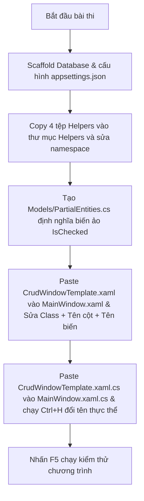

# Cẩm Nang Tái Sử Dụng Giao Diện & Logic CRUD Chuẩn (XAML & C#)

Tài liệu này hướng dẫn chi tiết cách tái sử dụng hai tệp mẫu chung từ bộ Kit:
*   [CrudWindowTemplate.xaml](file:///d:/Coding Space/FPT/PRN212/PE_EXAM_KIT/Kits/Templates/CrudWindowTemplate.xaml)
*   [CrudWindowTemplate.xaml.cs](file:///d:/Coding Space/FPT/PRN212/PE_EXAM_KIT/Kits/Templates/CrudWindowTemplate.xaml.cs)

để giải quyết nhanh câu WPF CRUD (Câu 2) trong các đề thi thực tế.

---

## PHẦN I: HƯỚNG DẪN XỬ LÝ FILE GIAO DIỆN (XAML)

Khi dán toàn bộ nội dung từ `CrudWindowTemplate.xaml` vào `MainWindow.xaml` của dự án thi, bạn **bắt buộc** phải chỉnh sửa 4 điểm sau để không bị lỗi biên dịch:

### 1. Đồng bộ Namespace Class (Dòng 1)
```xml
<!-- Thay thế dòng Class ở đầu file -->
<Window x:Class="Q2.MainWindow"  <!-- Đổi "PRN212.ExamKit.Templates.CrudWindow" thành Class thực tế của dự án thi -->
```

### 2. Thiết lập cột và Binding cho DataGrid (Zone 2)
Cấu hình lại các cột hiển thị trên DataGrid chính để khớp với các trường dữ liệu của **Thực thể chính**:
```xml
<DataGrid x:Name="dgProducts" AutoGenerateColumns="False" IsReadOnly="True" AlternatingRowBackground="#F9FAFB">
    <DataGrid.Columns>
        <!-- Thay đổi Binding trỏ đến các thuộc tính trong Model thực tế -->
        <DataGridTextColumn Header="ID" Binding="{Binding ProductId}" Width="50"/>
        <DataGridTextColumn Header="Tên sản phẩm" Binding="{Binding ProductName}" Width="*"/>
        <DataGridTextColumn Header="Danh mục" Binding="{Binding Category.CategoryName}" Width="150"/> <!-- Eager Loading hiển thị bảng liên kết -->
        <DataGridTextColumn Header="Giá bán" Binding="{Binding Price, StringFormat={}{0:N2}}" Width="120"/>
        <DataGridTextColumn Header="Tồn kho" Binding="{Binding Stock}" Width="100"/>
    </DataGrid.Columns>
</DataGrid>
```
> [!CAUTION]
> **Điểm cực kỳ quan trọng:** Xóa bỏ thuộc tính `SelectionChanged="DgRecords_SelectionChanged"` ở thẻ `<DataGrid>` nếu đề thi không yêu cầu bấm vào dòng Grid để hiển thị chi tiết lên Form, để tránh lỗi thiếu hàm sự kiện trong code-behind.

### 3. Tùy biến các ô nhập liệu Form (Zone 3 - Cột bên trái)
*   Sao chép hoặc xóa bớt các khối `<Grid>` nhập liệu để khớp với số lượng trường dữ liệu đề thi yêu cầu.
*   Đặt tên các TextBox và ComboBox bằng thuộc tính `x:Name` rõ ràng (ví dụ: `txtProductName`, `txtPrice`, `txtStock`, `cboCategory`).

### 4. Tùy biến CheckedListBox (Zone 3 - Cột bên phải)
*   Đổi tên ListBox thành tên biến phù hợp (ví dụ: `lstSuppliers` hoặc `lstSkills`).
*   **Sửa Binding hiển thị tên:** Tìm thẻ `<CheckBox>` bên trong DataTemplate, đổi thuộc tính `Content="{Binding DisplayName}"` thành tên trường hiển thị thực tế của bảng phụ (ví dụ: `Content="{Binding SupplierName}"` hoặc `Content="{Binding SkillName}"`).

---

## PHẦN II: HƯỚNG DẪN XỬ LÝ FILE LOGIC CODE-BEHIND (C#)

Khi sao chép mã nguồn từ `CrudWindowTemplate.xaml.cs` dán vào `MainWindow.xaml.cs` của dự án thi, hãy thực hiện thao tác **Find & Replace (Ctrl + H)** trong Visual Studio để tự động sửa lỗi hàng loạt:

### 1. Bản Đồ Thay Thế Tên Thực Thể (Sử dụng Ctrl + H)
| Từ khóa gốc trong bộ Kit | Đổi thành thực tế của đề thi | Ý nghĩa / Ví dụ |
| :--- | :--- | :--- |
| `Prn21226sprB11Context` | **[Tên DbContext sinh ra]** | Ví dụ: `Prn21226sprB12Context` |
| `Employees` | **[Thực thể chính]** | Thực thể hiển thị ở Grid và Form (ví dụ: `Products`) |
| `Departments` | **[Thực thể danh mục]** | Thực thể chọn trong ComboBox (ví dụ: `Categories`) |
| `Skills` | **[Thực thể tích chọn]** | Thực thể chọn nhiều trong ListBox (ví dụ: `Suppliers`) |

### 2. Bản Đồ Thay Thế Tên Biến Điều Khiển (Sử dụng Ctrl + H)
| Tên biến gốc trong bộ Kit | Đổi thành thực tế của đề thi | Ý nghĩa |
| :--- | :--- | :--- |
| `cboFilterDept` | `cboFilterCategory` | ComboBox lọc thứ nhất |
| `cboFilterSkill` | `cboFilterSupplier` | ComboBox lọc thứ hai (nhiều-nhiều) |
| `cboDept` | `cboCategory` | ComboBox chọn danh mục ở Form nhập |
| `lstSkills` | `lstSuppliers` | ListBox chứa Checkbox chọn nhiều |
| `dgEmployees` | `dgProducts` | Lưới hiển thị danh sách dữ liệu chính |
| `txtFullName` | `txtProductName` | TextBox nhập tên |
| `txtSalary` | `txtPrice` | TextBox nhập số thực (tiền/điểm) |

### 3. Bổ sung các biến phụ trong Form nhập liệu
Nếu thực thể chính trong đề thi của bạn có nhiều hơn 2 TextBox nhập liệu (ví dụ: ngoài Name, Price còn có Stock, Email...), bạn chỉ cần khai báo thêm biến đọc dữ liệu tương ứng trong sự kiện nút Add:
```csharp
// Đọc thêm trường Stock (Số nguyên)
string stockText = txtStock.Text.Trim();

if (!ValidationHelpers.TryParseInt(stockText, out int stock) || stock < 0)
{
    WpfHelpers.ShowError("Stock must be a non-negative integer.");
    return;
}

// Gán thuộc tính khi khởi tạo đối tượng mới:
var product = new Products
{
    ProductName = productName,
    Price = price,
    Stock = stock, // Gán thuộc tính vừa đọc thêm
    CategoryId = Convert.ToInt32(categoryVal)
};
```

---

## PHẦN III: QUY TRÌNH 5 PHÚT LẮP GHÉP BÀI THI THỰC TẾ



### Các điểm cần lưu ý trước khi bấm chạy thử (F5):
1.  Đảm bảo file `appsettings.json` đã được đổi thuộc tính sang **Copy if newer**.
2.  Đảm bảo phương thức `OnConfiguring` trong DbContext đã được chuyển đổi để sử dụng kết nối động từ file cấu hình JSON.
3.  Đảm bảo thuộc tính `IsChecked` trong partial class phụ trùng khớp namespace với các Model thực thể sinh ra.
